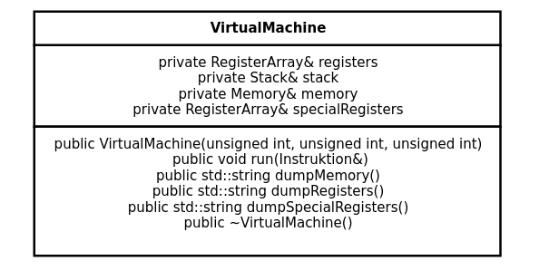
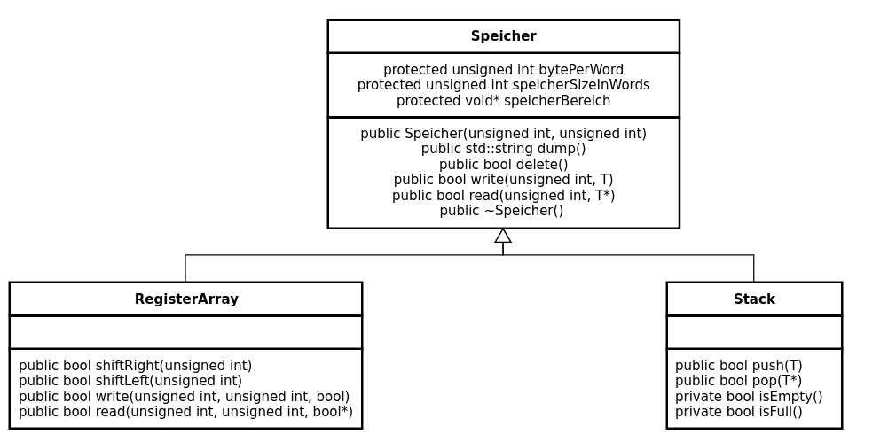
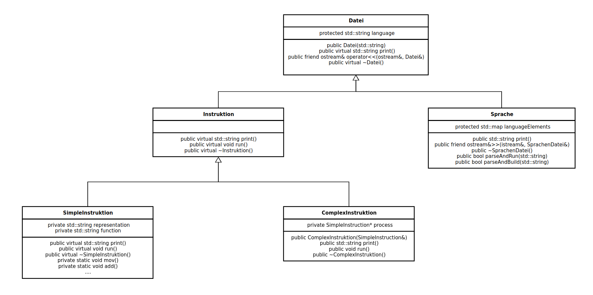
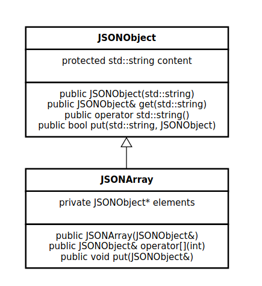
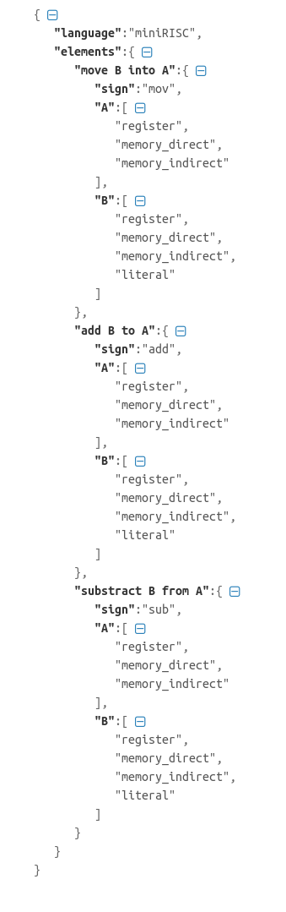

# Konzolbasiertes Interpreter eines dynamisch geschriebenen, konfigurierbaren Spraches

## Die Idee

Die Hauptidee des Programmes ist, den User eine eigene Beschreibungssprache konstruieren zu erlauben und dasselbe Sprache in einem dynamisch geschriebenen Art verwenden um eine eigene Programm zusammenzustellen (der später im File gespeichert werden kann). 
Das Sprache ist an den Prinzipen des Assembly-Spraches basiert, und enthält nur sehr atomische Instruktionen, die natürlich jede sinnvolle Problem lösen lassen.

## Die geplannte Umsetzung

Der Benutzer bekommt eine CLI Tool, die die folgende machen kann:

1. Eine leere, zu füllende Sprachendatei erstellen (JSON-basiert, damit es automatisch generiert werden kann sowohl aus dieser Programm als auch mit Hilfe von 3rd Party Programms).1
2. Eine gefüllte Sprachendatei einladen (und natürlich verifizieren, ob es wirklich gut gefüllt wurde).
3. Aus der eingeladeten Sprache einen inneren Konzol erstellen, in denen der Benutzer folgende tun kann:
    1. Schritt für Schritt eine Programm eintippen.
    2. Subroutine und Labels definieren (mit Hilfe von einer reservierten Schlusswort oder Bezeichnung, z.B. `def` oder `:`).
    3. Definitionsbibliotheken aus speziellen Dateien einladen.
    4. Soweit eingetippte Schritte ansehen und die ganze History im Datei speichern.
    5. Registern, Stack und Speicher im File (oder aus dem Standardausgang) schreiben
4. Mit Hilfe von verschiedenen Sprachendateien Programme zwischen Sprachen umwandeln (erledigt z.B. wirkliche Assemblykode zu generieren, der später assembliert werden kann).

## Der Komplexität

Obwohl ich nach eine sehr einfaches Implementation streben möchte, damit es nicht schwierig wird den ganzen Software überzusehen, ist es unvermeidlich einige komplexere Sachen im Program zu verwenden. Damit zu hilfen habe ich die folgende Typusgraphen erstellt: 

A VirtualMachine class für den Ausführung des Kodes: 

Dieses VirtualMachine enthält verschiedene Speichern (Stack, Registers, RAM), diese sind in den folgenden Klassen implementiert:

Sowohl Instruktionen, als auch Sprachendateien können im File geschrieben werden, diese haben folgende Typusbaum:

Mit Dateioperationen ist diese JSON Implementation zu hilfen:

Diese sind natürlich nur Planen, und können während der Entwicklung geändert werden, sie stehen hier nur um die Erklärung der Idee zu erleitern.

Die folgende Komplexitätskriterien stehen im Plan (aus der 5 spezifizierte Kriterien):
* Templates
* Operatorüberladung
* Mehrfachvererbung
* Dynamische Membervariable

---
1: Eine Beispieldatei (nur die Idee zu zeigen)

